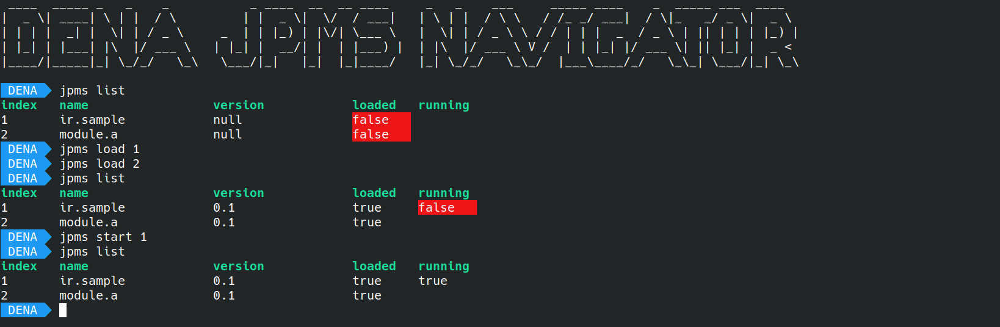

## [In Memory Of IRIS DENA](https://en.wikipedia.org/wiki/IRIS_Dena)

# Dena Project 
Control and manage JPMS(Java Platform Modular System) dynamically 

# Example Code : 

```java
import ir.moke.dena.api.IModule;
import org.slf4j.Logger;
import org.slf4j.LoggerFactory;

import java.util.Timer;

public class ModuleRunner implements IModule {
    private static final Logger logger = LoggerFactory.getLogger(ModuleRunner.class);
    private Timer timer;

    @Override
    public void start() {
        timer = new Timer("Sample Timer Module");
        timer.schedule(new TaskExecutor(), 0, 2000);
        logger.info("Module Started");
    }

    @Override
    public void stop() {
        timer.purge();
        timer.cancel();
        logger.info("Module Stopped");
    }
}
```

